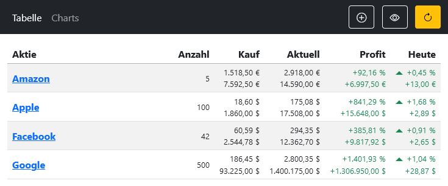

scheb/stock-panel
=================

I've written this Symfony application for myself to keep track of my stock portfolio.

It uses my [Yahoo Finance API library](https://github.com/scheb/yahoo-finance-api) to fetch current quotes and  calculates profit / loss from it.

Features
--------

- Add any stock available on Yahoo Finance
- Show daily wins/losses
- Show overall wins/losses
- Add stocks to watch
- Auto and forced refresh on the tabular view
- Privacy feature to hide sensitive information

**Tabular view**

**Charts view**

Requirements
------------

- PHP8.2
- [Composer package manager](https://getcomposer.org/)
- [Yarn package manager](https://yarnpkg.com/)

Installation
------------

1) Configure Symfony environment variables, e.g. as an `.env.local` file (example can be found in `.env.dist`)
2) Install Composer dependencies: `composer install`
3) Initialize the database: `bin/console doctrine:schema:create`
4) Install Yarn dependencies: `yarn install`
5) Build production assets: `yarn build`

License
-------

This software is available under the [MIT license](LICENSE).

Contributing
------------

Thanks for your interest in contributing to this project! Glad you like it 😊

I typically do not accept contributions to this project, as I've built this for myself and it just works fine for me the
way it is. The project isn't intended to work for anyone but myself. I've put it onto GitHub in case someone finds this
useful. So if you need changes, feel free to fork the repository and modify it for your own needs.

If you have an idea that you believe is worth integrating, please reach out first. I don't want you to work on things
that I wouldn't merge.

Support Me
----------

I love to hear from people using my work, it's giving me the motivation to keep working on it.

If you want to let me know you're finding it useful, please consider giving it a star ⭐ on GitHub.

If you love my work and want to say thank you, you can help me out for a beer 🍻️
[via PayPal](https://paypal.me/ChristianScheb).
