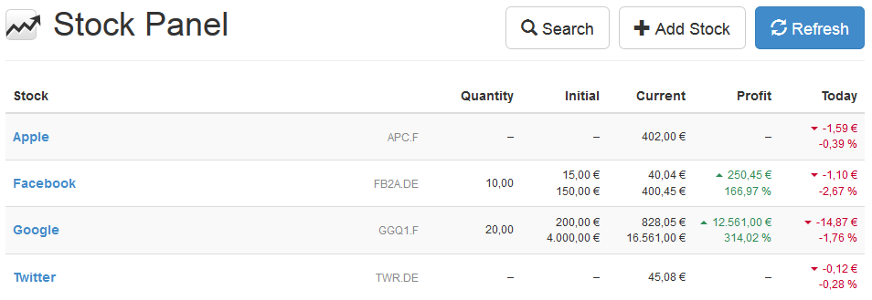

scheb/stock-panel
=================

I've written this Symfony application for myself to keep track of my stock portfolio.
It uses my Yahoo Finance API to fetch current quotes and calculates profit and loss from it.



## Requirements

- PHP7
- MySQL database
- LESS

## Installation

1) Configure `.env` file.
2) Execute commands:

```
composer install
php bin/console braincrafted:bootstrap:install
php bin/console assetic:dump
```
